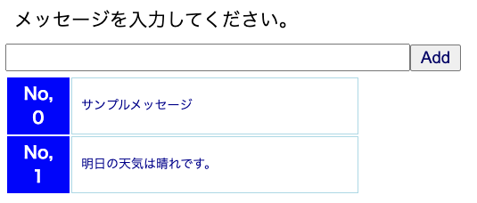
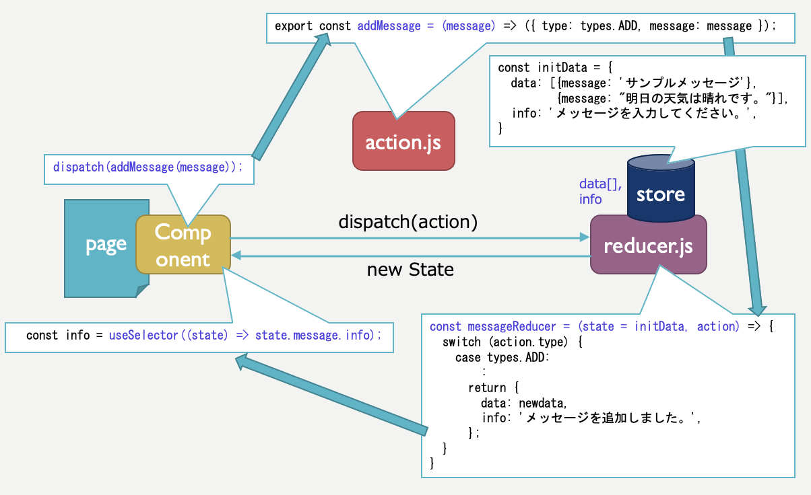

# next-redux1

React.js + Redux.js + Next.jsにおける、ReducerとAction Creatorのサンプルです。 
Formから入力したメッセージをReduxのストアで保管し、ストアのデータをリアルタイムに表示します。 

* AddFormコンポーネントとMemoコンポーネントで共有するデータ（今回は入力したメッセージの配列）をReduxのストアで管理する。

* npx create-next-app --example with-redux-thunk next-app で作成した雛形を編集した。

